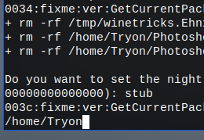

# Photoshop CC v21.2.4 installer for Linux
This program written in C will help you to automatically install everything you need and configure it so that you can run Photoshop on your Linux without problems.


 

## :rocket: Features
- Automatically check your system requirements (read below) so you know if you can install Photoshop
- Automatically install everything you need to run Photoshop
- Creates a Photoshop shortcut in your Gnome Apps for execute it
- Install and configure Adobe Camera Raw v12, if you want
- If you don't use Photoshop anymore, you can uninstall all files in a custom way
- Support wine dark mode
- It's free and you will not need any license key

## :computer: Installation
If you are new in Linux and don't know some commands, you can watch this video (made thanks to Don of Novaspirit Tech channel) for more easy installation:

[](https://www.youtube.com/watch?v=yF7nvzaIITg)

## Compatible Distros:
- Fedora (Compatible with all versions that share the same WineHQ repository, currently from 29 to 34)
- Debian 10 (Buster) and any other Debian based distro
- Arch Linux and any other Arch based distro
- Gentoo Linux


## Installation steps:

```bash
mkdir Adobe
```
```bash
cd Adobe
```

```bash
git clone https://github.com/CSMarckitus/Photoshop.git
```

```bash
git clone https://gitlab.com/csmarckitus1/photoshop.git
```

```bash
cd photoshop

```

```bash
./Photoshop2020
```

#### After donlowad complited (Enter: 2 for install Photoshop:)


---

#### Type "2" then hit Enter
```bash
2
```
#### Now show some Operating System like Debain, Ubuntu, etc. Choise your os system Type "Require Number" then hit Enter. 

---
#### My os Debain so need to type here 1


#### Type "Y" then hit Enter

```bash
Y
```
#### Hit Enter then Y etc.

#### When show like following  {Now write your user name "My usr name is 'Tryon' so need type it like below "}


---

###### To


---


#### Some time will open a wine popup window there select Install the Enter


---


#### During Installation need some selections and configurations like language select "english/spanise" etc

#### Type "englilsh" Enter


---
```bash
english
```
#### Type "all" Enter


---

###### To


---


####⚠️ If Photoshop file not save. then try to export as file_name.psd Done. After save file will you see there are all layer seperatly, Don't worry open the main psd file here all ok.⚠️


#### Important things during the installation:
During the installer you will see for a moment that Windows 7 is selected by default, change it to Windows 10.
If you have a 4k monitor or open Photoshop and it looks small, in the same place go to the Graphics tab and increase the resolution between 216 and 240 ppp.Once all this is done apply the changes.Photoshop may sometimes start with a black screen, just Create a new file or just drag in some photo.
Before starting any project try to Save the file first. In case it doesn't let you do the following:

## ⚠️ Very Very Important things for some linux distro

#### After Completed Installation if not work photoshop  "clone stamp tool"  to define source point by click  "atl+mouse_left"   you need to change "window manager tweaks" behover on your linux settings, because window behover shortcut override to photoshop Atl keyword.


